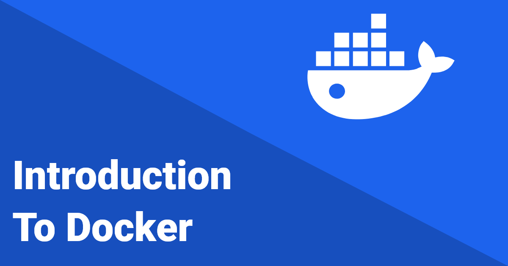

# Introduction To Docker

When developers work on a project, there is a common issue that happens almost every time: the project works wonderfully on the developer's machine, but when it is moved to production, a server or another team member's computer, it fails to function properly. This is commonly known as the **"It Works on My Machine"** problem.

## **The "It Works on My Machine" Problem**

Consider creating a website with Node JS or PHP. On your local PC, everything works flawlessly like the code runs, the images load properly, and the routes are correctly configured. However, when you migrate the project to a production server or another environment, you encounter challenges such as:

-   Images are not loading properly.

-   Path configurations breaking.

-   Missing dependencies or incorrect settings.

This problem becomes more severe in large-scale projects that include programming languages like **Node.js**, **Python**, **Java**, **Ruby**, or **PHP** etc.

This is where **Docker** comes in to solve the problem.

## **What is Docker?**

Docker is mainly designed to solve the "It Works on My Machine" problem. It enables developers to package applications and environments in portable, lightweight, and isolated containers. These containers ensure that the application runs consistently across different machines.

It is compatible with nearly any programming language or project and it is a tool that creates airtight containers.

## **Understanding Docker Containers**

At the heart of Docker are **containers**. These containers wrap up your:

-   Code

-   Dependencies

-   Configuration files

-   Processes

-   Networking settings

-   (In some cases) a lightweight chunk of the operating system.

### **Key Features of Docker Containers**

1. **Portability**: Docker containers are portable and consistent. You can move them from one machine to another—whether it's your laptop, a colleague's computer, or a production server—and they will run the same way.

2. **Sealed Environment**: Containers create a sealed, isolated environment where your application runs without being affected by the underlying system.

3. **Reusability**: Containers can be reused and shared easily.

With Docker, the phrase _"It works on my machine"_ becomes irrelevant because the container behaves identically no matter where it is deployed.

## **Docker as a Social Platform**

Docker doesn't just stop at solving local development problems. It also allows developers to share their containers like they would share a status update on social media.

For example:

-   Instead of struggling to install **MySQL**, you can simply pull a Docker container preconfigured with MySQL and start using it instantly.

-   You can **publish Docker containers** and share them with others, so anyone can replicate your environment effortlessly.

## **How Docker Works: The Three Essentials**

To summarize, Docker can be divided into three main components:

### **1\. Docker as a Client-Side Application**

Docker acts as a client-side tool that you can install on your machine. It handles everything:

-   Designing containers.

-   Packing your code, dependencies, and configurations.

-   Making the application portable.

### **2\. Docker as a Service**

Docker can also be deployed as a service on a server. This allows you to:

-   Deploy containers anywhere.

-   Run your applications consistently in any environment.

### **3\. Docker as a Social Platform**

Docker allows you to share and publish your containers:

-   Developers can share their container images, similar to how you share files or posts on social media.

-   Others can download and start from a specific **checkpoint** of your application.

## **Key Benefits of Docker**

1. **Consistency**: Docker ensures your project runs the same on any machine.

2. **Portability**: Containers can be deployed anywhere—on local systems, servers, or the cloud.

3. **Simplified Installation**: Complex installations, like MySQL or Python libraries, become frictionless with Docker containers.

4. **Collaboration**: Sharing containers makes it easy for teams to work together seamlessly.

## **Conclusion**

Docker solves the well-known "It Works on My Machine" problem by creating portable, sealed, and shareable containers that perform similarly in all contexts. Whether you're running a tiny web app or a large-scale project, Docker provides a uniform and smooth experience for developers and production teams.

If you haven't already explored Docker, now is the time to get started and simplify your development process!

Thank you for reading! 🚀

Happy learning! 😊
