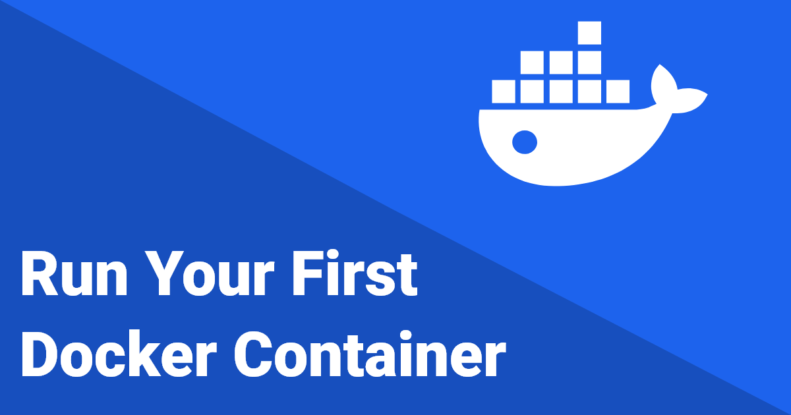
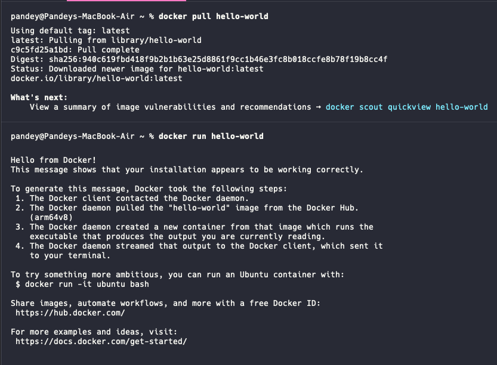
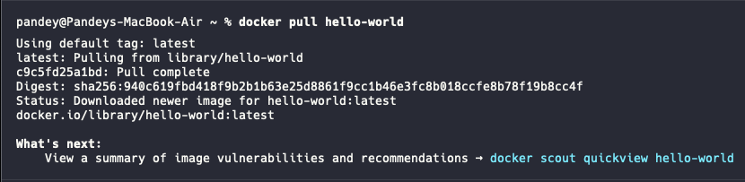
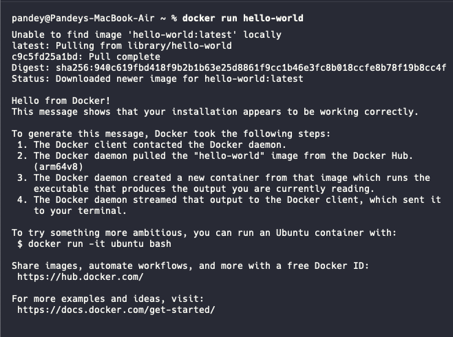
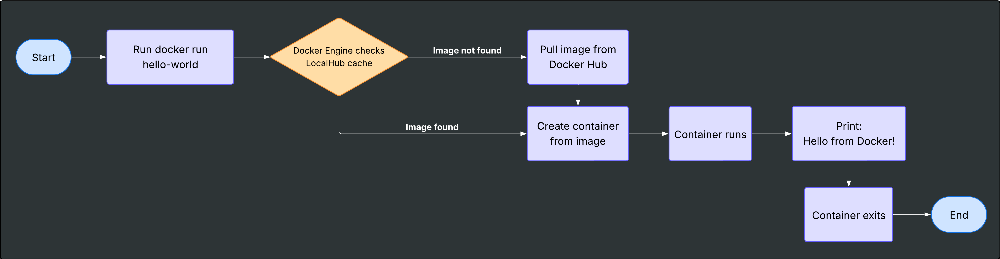

# Run Your First Docker Container: Understanding the Magic Behind the Scenes



Running your **very first Docker container** is a magical moment.

Most Docker tutorials start with these two simple commands:

```bash
docker pull hello-world
docker run hello-world
```

And Docker responds:



That’s it. Success! 🎉

It works so fast and so smoothly that you might miss what’s really happening in the background. It prints `Hello from Docker!` and you’re left thinking: _“Wait... that’s it?”_

This guide isn't just about running a command. We're going behind the scenes to understand exactly how Docker works the first time you run a container. We’ll use a simple diagram and explain each step clearly, so Docker feels less like magic and more like a powerful tool in your development journey.

Let’s break it down.

## 🧠 What Happens When You Run a Docker Command?

While the commands seem simple, a lot is happening under the hood.

### 👤 Step 1: You (the User)

You are the user sitting at your machine. You’ve installed Docker and are ready to run containers maybe `MySQL`, `PostgreSQL` or a simple `hello-world` image.

### ⚙️ Step 2: Docker Engine

What you have actually installed is the Docker Engine — the underlying tech that handles the build, run, and lifecycle of containers.

Think of it as the core engine that interprets your commands and talks to other Docker components.

### 🗂 Step 3: Local Docker Repository (aka Cache)

When you run `docker run hello-world`, Docker first checks if this image (`hello-world`) is already present in your **local image cache**.

If it’s already available locally, Docker skips downloading and moves straight to running it.

### 🌐 Step 4: Docker Hub (Cloud Repository)

If the image is not found locally, Docker reaches out to **Docker Hub** — the official public registry where developers share and download Docker images.

It downloads the image (only once) and stores it locally. From next time, it won’t re-download unless there's a version mismatch or cache clear.

## `docker pull` vs `docker run`

Let’s demystify the difference:

### ✅ `docker pull hello-world`

-   Downloads the `hello-world` image from Docker Hub.
-   Stores it locally.
-   Doesn’t run it.



### ✅ `docker run hello-world`

-   First checks if the image exists locally.
-   If not, it pulls the image (like `docker pull`).
-   Then **creates a container** from that image and **runs** it.



So, in a way:

```bash
docker run hello-world
```

is the same as:

```bash
docker pull hello-world
docker create hello-world
docker start <container_id>
```

> 💡 **Did you know**:  
> The [hello-world](https://hub.docker.com/_/hello-world) image has been downloaded over **1 billion** times on Docker Hub! It’s that iconic.

## Understanding Images vs Containers

-   **Image:** A read-only template with the application code and environment.
-   **Container:** A running instance of an image (like a lightweight virtual machine).

You can run multiple containers from the same image.

## 🖥 Visualizing the Flow

Let’s understand the flow:



1. 🧑‍💻 You run `docker run hello-world`.
2. 🔍 Docker Engine checks the **local cache** (LocalHub).
3. 📦 If not found, it pulls the image from **Docker Hub**.
4. 🧱 It **creates** a container from the image.
5. ▶️ The container runs and prints: `Hello from Docker!`
6. 🛑 The container exits after execution (since the program is just a print statement).

You can view all this using Docker Desktop (GUI) or `docker ps -a` to list all containers (even exited ones).

## 🎯 Bonus: Clean-Up and Retesting

Let’s say you want to clean everything and try again:

### 🛑 Stop and Remove Containers:

```bash
docker ps -a           # List all containers
docker stop <id>       # Stop running container
docker rm <id>         # Remove stopped container
```

### 🧹 Remove the Image:

```bash
docker rmi hello-world
```

Now when you run `docker run hello-world`, it will trigger a fresh download.


**🎉 You Did It!**

If you’ve followed along, you’ve not only run your first Docker container, but you've also understood exactly how and why it worked.

You now know:

-   What Docker Engine is.
-   How images and containers relate.
-   The role of Docker Hub.
-   What `pull` vs `run` really means.

I hope you found this blog helpful and informative. I would love to hear your thoughts and feedback. If you have any questions or suggestions, feel free to reach out.

Thanks for reading! 🙌

Happy learning! 🐳
