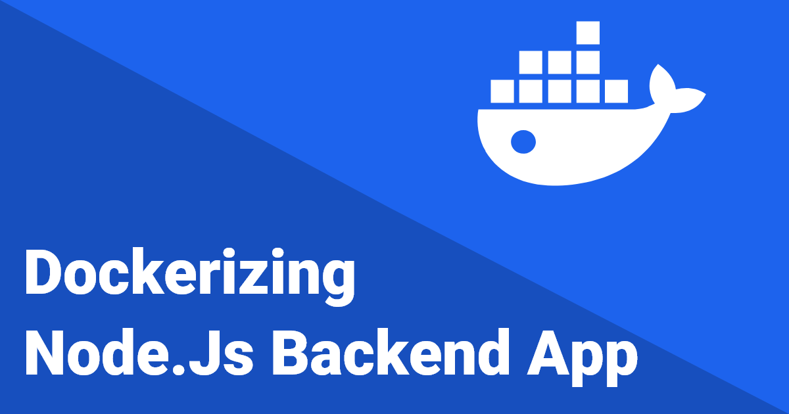
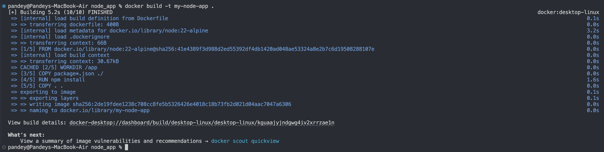
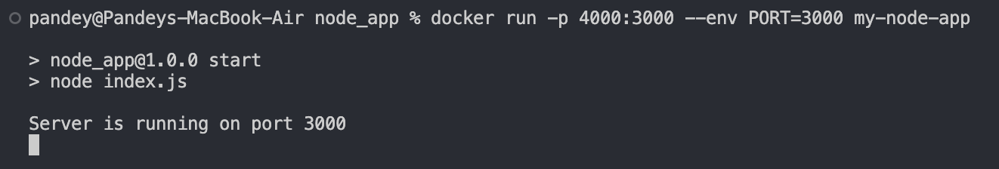
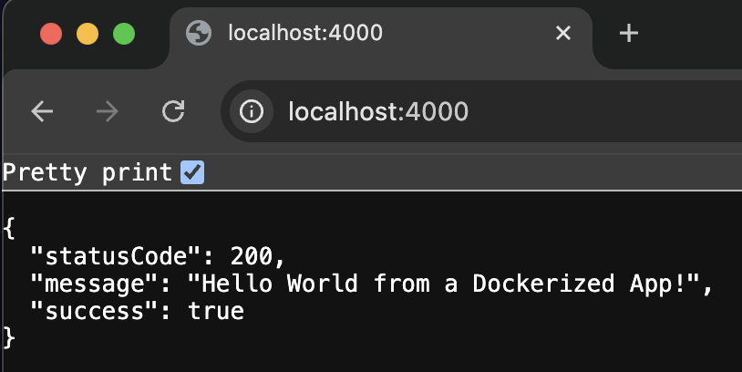

# Dockerizing Node.js Backend App



After learning the [Basics of Docker](https://blog.omprakashpandey.com/introduction-to-docker) and [Running Your First Docker Container](https://blog.omprakashpandey.com/run-your-first-docker-container-understanding-the-magic-behind-the-scenes), It's time to take the next step: Let's containerize our Node.js backend application!

In this blog, we will **containerize a real Node.js backend application** while also building a solid understanding of Docker’s three core concepts:

-   **Docker Images**
-   **Docker Containers**
-   **Dockerfile**

## 🎯 What We will Build

We will create a simple Node.js app and Dockerize it. But more importantly, we will explore the **magic behind** how Docker works and why these components matter.

## First, Let’s Understand Docker’s Core Concepts

### 1\. 🐳 Docker Image

A **Docker image** is a **lightweight, standalone, executable package** that includes:

-   Your code
-   Runtime (Node.js in our case)
-   Libraries
-   Environment variables
-   Configuration files
-   Sometimes even parts of the operating system

Think of it as a **blueprint**. Once it’s built, it **cannot be changed** (images are **immutable**). If you need updates, you create a **new version** of the image.

Images are built **layer by layer**, which means:

-   Each instruction in a Dockerfile creates a new layer.
-   Docker caches these layers, making builds faster and more efficient.
-   Understanding layers = optimizing your builds.

Also, images are **portable**. They can run on any OS where Docker is installed (e.g Linux, Windows or macOS).

### 2\. 📦 Docker Container

A **Docker container** is a **runtime instance of an image**.

Imagine your image is a blueprint for a car, and containers are the actual cars running on the road. You can spin up as many containers as you want from the same image.

Key traits of containers:

-   **Isolated**: Each container runs independently.
-   **Ephemeral**: Once stopped, a container is gone for good. (You’ll have to create a new one.)
-   **Portable**: Move containers across environments with ease.

Containers make it possible to **run the same image in development, staging, or production**, just by changing environment variables. One image → many environments.

### 3\. 📜 Dockerfile

Now this is where **you**, the developer, come in.

A **Dockerfile** is a set of **declarative instructions** that tells Docker how to build an image.

You don’t write “code” like in JavaScript or Python. You simply **declare what you want**:

-   What base image to start from
-   What files to copy
-   What commands to run
-   What port to expose

> 💡 It's easier than a programming language. Just tell Docker **what** to do, and it will handle the **how**.

We’ll write a Dockerfile together below.

## 🛠️ Let's Dockerize Node.js App

### 1\. Initialize the Project

First, create a new directory for your Node.js app and initialize it:

```bash
mkdir node-app
cd node-app
npm init -y
npm install express
```

### 2\. Create the App (`index.js`)

```js
const express = require("express");
const app = express();

const port = process.env.PORT || 3000;

app.get("/", (req, res) => {
    res.status(200).json({
        statusCode: 200,
        message: "Hello World from a Dockerized App!",
        success: true,
    });
});

app.get("/health-check", (req, res) => {
    res.status(200).json({
        statusCode: 200,
        message: "Health check passed",
        success: true,
    });
});

app.listen(port, () => {
    console.log(`Server is running on port ${port}`);
});
```

## 3\. Dockerfile – Let's Declare the Image Instructions

Let’s create a `Dockerfile` in the root of your project directory. This file will contain all the instructions to build your Docker image.

```Dockerfile
# use an official Node.js runtime as a parent image
FROM node:22-alpine

# set the working directory inside the container
WORKDIR /app

# copy package.json and package-lock.json to the working directory
COPY package*.json ./

# install dependencies
RUN npm install

# copy the rest of the application code to the working directory
COPY . .

CMD ["npm", "start"]
```

> **Note:** The `RUN` command executes during the image build process, while `CMD` specifies the default command to run when a container starts.

This Dockerfile creates a **layered, immutable, portable** image. Every line adds a new layer, which Docker caches for optimization.

## 🙈 Don’t Forget `.dockerignore`

```markdown
node_modules
npm-debug.log
```

This avoids copying unnecessary files into the image, keeping it lightweight.

## 🧪 Build and Run the Docker Container

### Step 1: Build the Image

```bash
docker build -t my-node-app .
```



### Step 2: Run the Container

```bash
docker run -p 4000:3000 --env PORT=3000 my-node-app
```



-   `-p 4000:3000` maps local port 4000 to container port 3000.
-   `--env` sets the environment variable inside the container.

Now visit [`http://localhost:4000`](http://localhost:4000) and you should see:




Congratulations 🎉 You Did It!

You just built and run your first Dockerized Node.js app!

## 🌱 Bonus: Use `.env` for Clean Environment Management

Create a `.env` file:

```markdown
PORT=3000
```

Run it like this:

```bash
docker run --env-file .env -p 4000:3000 node-app
```

## 🧹 Cleanup Tips

To stop all running containers:

```bash
docker ps
docker stop <container_id>
```

To remove images:

```bash
docker rmi node-app
```

## 🧠 Quick Recap

| Concept        | Description                              |
| -------------- | ---------------------------------------- |
| **Image**      | Blueprint of your software (code + deps) |
| **Container**  | Running instance of the image            |
| **Dockerfile** | Instructions to build the image          |

Docker works because these three main components come together and work as one. Once you understand these, you're on your way to mastering Docker.

I hope you found this blog helpful and informative. I would love to hear your thoughts and feedback. If you have any questions or suggestions, feel free to reach out.

Thanks for reading! 🙌

Happy learning! 🐳
